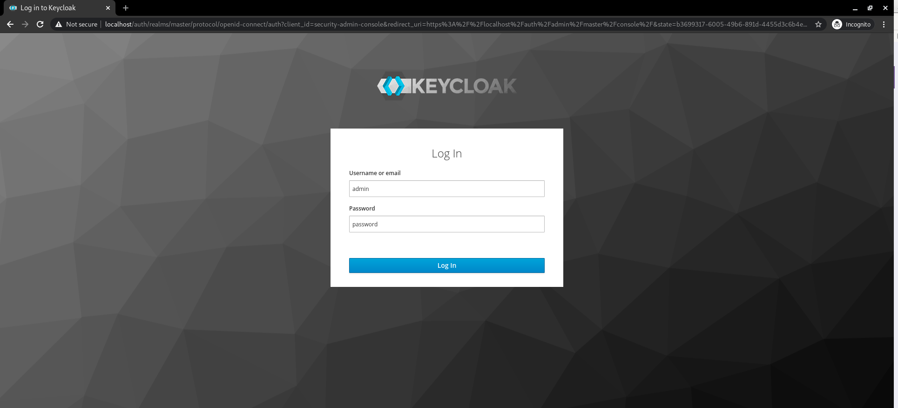
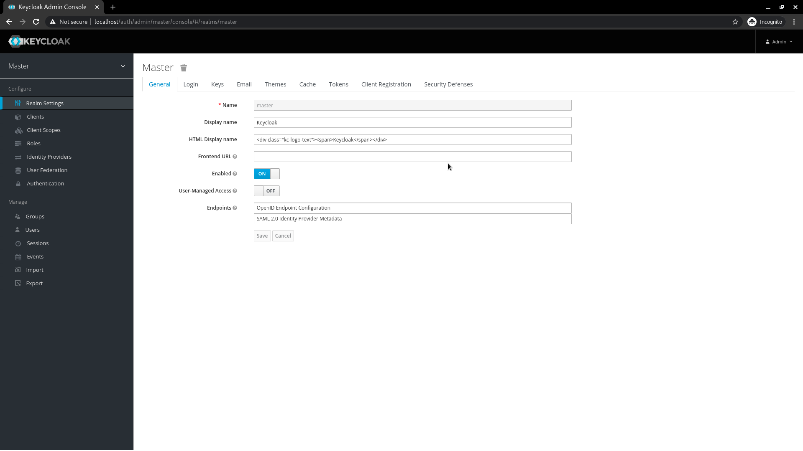

# keycloak-postgres-https
Custom docker image for using **Keycloak latest** with PostgreSQL over SSL/TLS on https://sso.localhost

----
## **1. Prerequisites**
 - [Linux Distribution - ubuntu ](https://ubuntu.com/tutorials/install-ubuntu-desktop)
 - [Docker](https://github.com/genral73/docker)
 - [Docker-compose](https://github.com/genral73/docker-compose)

## **2. Installation**
- Add an entry to the hosts file, for sso server name, execute:
    ```bash
    sudo echo '127.0.0.1    *.localhost' | sudo tee -a /etc/hosts
    ```
- Download this repository to your home account, execute:
    ```bash
    cd ~/
    git clone https://github.com/genral73/docker-compose-examples.git
    cd docker-compose-examples/keycloak-postgres-https/
    ```
- Run the docker compose to start the serveices, execute:
    ```bash
    docker-compose up -d --build
    ```
    Wait a second for the Docker container to come up!

## **3. Connect to Admin Interface**
- Login to KeyCloak Admin Console on https://sso.localhost/auth/admin
- Use the credentials set as Environment variables from sso-keycloak continer, use **admin** & **password** to login.

-----


-----

